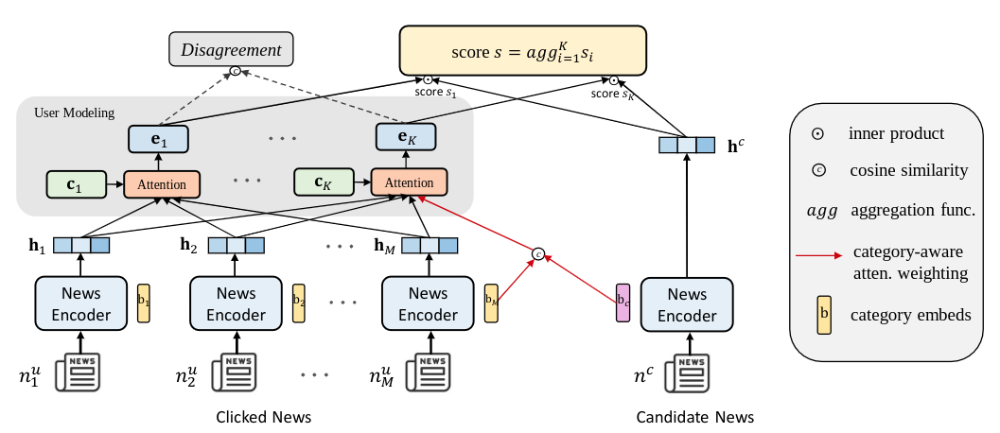

# README

My implementation for **MINER: Multi-Interest Matching Network for News Recommendation**. Please see 
[the paper](https://aclanthology.org/2022.findings-acl.29.pdf).



## Setup
### Requirements

I run my code with `Python==3.9`, `pytorch==1.11.0`, `transformers==4.21.0`, `scikit-learn==1.1.2`, `tensorboard==2.9.1`,
`tqdm==4.64.0`.


### Dataset
The datasets used in my experiments have some files: 


| File Name        | Description                                      |
|------------------|--------------------------------------------------|
| news.tsv         | The information of news articles                 |
| behaviors.tsv    | The click histories and impression logs of users |
| category2id.json | Mapping the category of news to id               |
| user2id.json     | Mapping the user to id                           |

The **behaviors.tsv** file contains the impression logs and users' news click histories. 
It has 5 columns divided by the tab symbol:

* **Impression ID**: The ID of an impression.
* **User ID**: The ID of a user.
* **Time**: The impression time with format "MM/DD/YYYY HH:MM:SS AM/PM".
* **History**: The news click history (ID list of clicked news) of this user before this impression. The clicked news 
articles are ordered by time.
* **Impressions**: List of news displayed in this impression and user's click behaviors on them (1 for click and 0 
for non-click). The orders of news in an impressions
have been shuffled.

The **news.tsv** file contains the detailed information of news articles involved in the **behaviors.tsv** file.
It has 4 columns, which are divided by the tab symbol:

* **News ID**: The ID of a news 
* **Title**: The title of a news 
* **Category**: The category of a news
* **Sapo**: The abstract/summary of a news

In the **category2id.json** file and **user2id.json** file, I use the ```<unk>``` token to encode categories and users that are not in training set. In addition, the ```<pad>``` token is also added to those.

## Training
Download the data and save it in ```data/```.


Single GPU training:

```shell
python main.py train @config/train.txt
```

## Evaluation
```shell
python main.py eval @config/eval.txt --saved_model_path path_to_your_saved_model
```

